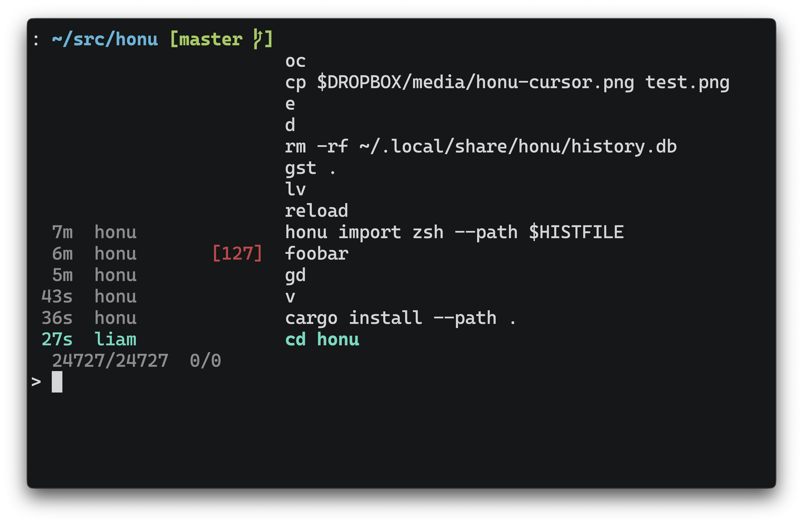

## honu


[](https://github.com/terror/honu/actions/workflows/ci.yaml)
[](https://codecov.io/gh/terror/honu)

`honu` records, imports, and searches your shell history with SQLite.



If you need help with `honu` please feel free to open an issue. Feature requests
and bug reports are always welcome!

## Installation

`honu` should run on Linux, macOS, and Windows.

For now, install the latest version from source using
[cargo](https://doc.rust-lang.org/cargo/), the Rust package manager:

```bash
cargo install --git https://github.com/terror/honu
```

## Prior Art

This project was inspired by tools like
[atuin](https://github.com/atuinsh/atuin) and [stinkpot](https://tangled.org/oppi.li/stinkpot).
